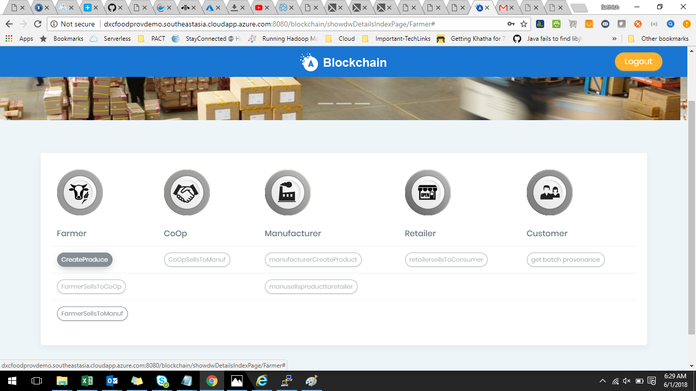
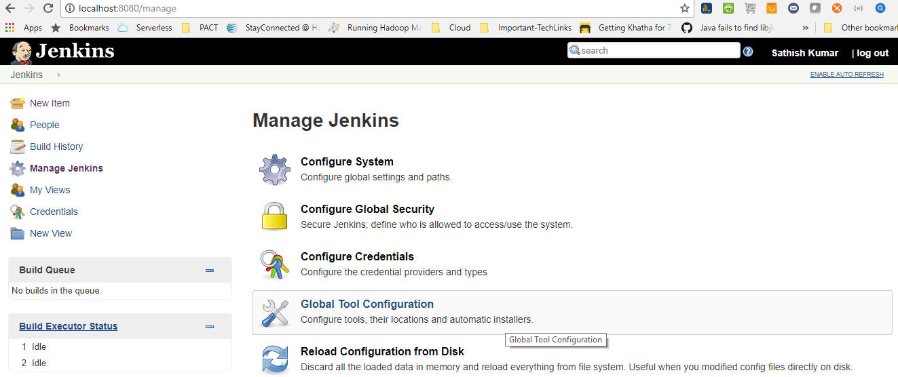
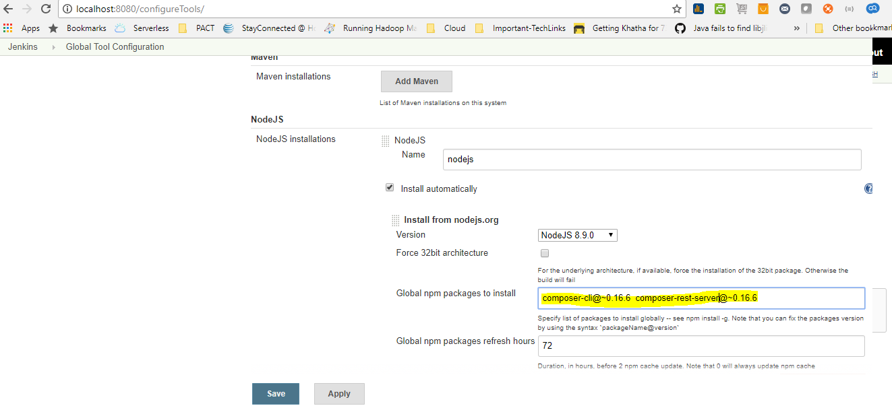

## Features

Hyperledger Fabric is a permissioned blockchain infrastructure, originally contributed by IBM and Digital Asset.

The primary difference between a permissioned blockchain network and an unpermissioned blockchain network is whether the participants in the network have an ability to restrict who can participate in the consensus mechanism of the blockchain’s network.

A blockchain creates trust, traceability, and immutability through a peer-to-peer network. All transactions in the network, such as payments or event tracking in a supply chain, are confirmed by participants in the network. Thus, no central authority alone controls the validity of these events. These acknowledgments given by the participants lead to a consensus in the network, with which the data on the blockchain is continually persisted. So the majority of the participants decide whether a transaction is valid, instead of a single player. 
It is a more resilient, extensible and scalable blockchain platform suitable for enterprises.

## Screenshot

# Hyperledger Fabric Provenance POC CI/CD Process

All the CI/CD configuration is prepared in Jenkins pipleline. 

## Jenkins Setup 

Before we begin integrating Hyperledger Fabric prjoect pipeline, we need to install three plugins:

1.) Node.js plugin, for node.js installations under jenkins user.   
2.) Gihub plugin, for integrating with Github.   
3.) Pipeline plugin, for congiguring pipeline stages.   

Note: After the plugins installation, we have to add new node.js installations in jenkins global tool configuration section.

## Environment Setup

### Step 1: Installing pre-requisites
To run Hypeledger Blockchain Platform, the below pre-requisites need to be installed on the platform on which you will be developing blockchain applications or operating Hyperledger Fabric.

Docker Engine	: Version 17.03 or higher  
Docker-Compose	: Version 1.8 or higher  
Node			: 8.9 or higher  
npm				: v5.x  
git				: 2.9.x or higher  
Python			: 2.7.x  

### Step 2: Install the CLI tools

There are a few useful CLI tools for Blockchain Platform developers. 

* composer-cli : Utility which contains all the essential operations.
* composer-rest-server : Utility for running a REST Server on your machine to expose your business networks as RESTful APIs.

### Step 3: Install Hyperledger Fabric

This step creates a local Hyperledger Fabric runtime to deploy business network application. 

	mkdir ~/fabric-dev-servers && cd ~/fabric-dev-servers
	curl -O https://raw.githubusercontent.com/hyperledger/composer-tools/master/packages/fabric-dev-servers/fabric-dev-servers.tar.gz
	tar -xvf fabric-dev-servers.tar.gz
	cd ~/fabric-dev-servers
	./downloadFabric.sh
	
## Build
	
Before a business network definition can be deployed it must be packaged into a Business Network Archive (.bna) file. The composer archive create command is used to create a business network archive file from a business network definition folder on disk.
	
## Deploy Business Networks

Once the business network archive file has been created it can be deployed to a runtime using the composer runtime install command followed by a composer network start command.

