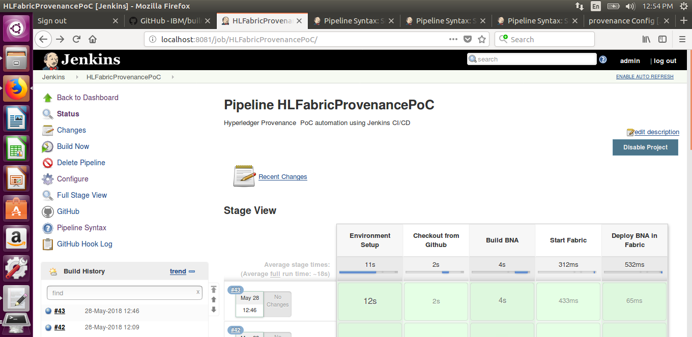

# Hyperledger Fabric Provenance POC CI/CD Process

All the CI/CD configuration is prepared in Jenkins pipleline. 

## Environment Setup

### Step 1: Installing pre-requisites
To run Hypeledger Blockchain Platform, the below pre-requisites need to be installed on the platform on which you will be developing blockchain applications or operating Hyperledger Fabric.

Docker Engine	: Version 17.03 or higher  
Docker-Compose	: Version 1.8 or higher  
Node			: 8.9 or higher  
npm				: v5.x  
git				: 2.9.x or higher  
Python			: 2.7.x  

### Step 2: Install the CLI tools

There are a few useful CLI tools for Blockchain Platform developers. 

* composer-cli : Utility which contains all the essential operations.
* composer-rest-server : Utility for running a REST Server on your machine to expose your business networks as RESTful APIs

